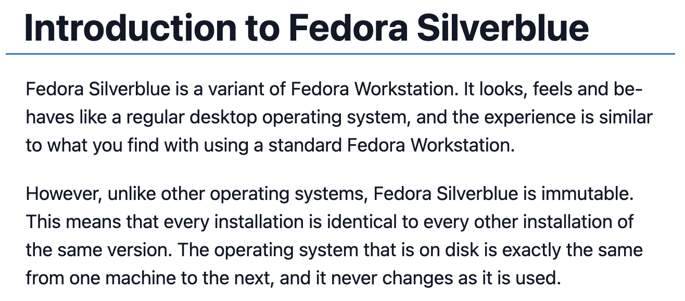

+++
title = "The Image-based Desktop: a saner approach to desktop computing"
date = "2023-08-19T17:55:10Z"

#
# description is optional
#
# description = "An optional description for SEO. If not provided, an automatically created summary will be used."

tags = []
+++

## Immutability

There's been a lot of talk going on in the Linux desktop space about "immutability". Loads of "immutable" distributions have popped up, promising greater safety, reliability, and stability compared to "traditional" Linux systems. What's the catch? How do they do it?

Let's head over to [Fedora Silverblue](https://fedoraproject.org/silverblue/)'s documentation and try to figure out how this approach works. Silverblue is one of the leading immutable distributions in use for the desktop.

"Every installation is identical to every other installation of this version"? "The operating system that is on disk is exactly the same from one machine to the next"?! This is outrageous! Do they expect all of our usecases and configurations to fit into a neat little box?

Thankfully, no, not exactly. In this article I will go through what maintainers of immutable distros mean when they describe their systems as "unchanging" and what workflows on immutable systems look like.

## Package management

A traditional Linux distribution